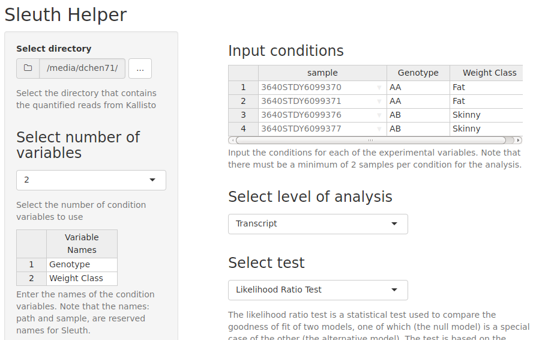

#Sleuth Helper

Sleuth helper is an companion shiny app to help process the data for Sleuth via GUI. 



#Run the App
Install the `shiny` R-package from CRAN:

```r
install.packages('shiny')
```

Clone this git repository, navigate to where the `ui.R` and `server.R` files are
located and run:

```r
shiny::runApp()
```

1. Select directory with Kallisto Pseudo-aligned reads
2. Select number of covariates
3. Input the names of the covariates
4. Input the factors for the covariates
5. Choose between transcript level and gene level analysis
6. Create the sleuth object

From here, you can save the object to the current working directory, create and save a gene table, and create and save test results. 

#Help
For more details about Sleuth and Kallisto, visit the following websites:

https://pachterlab.github.io/kallisto/  
https://github.com/pachterlab/sleuth

#Limitations
The app only works locally.